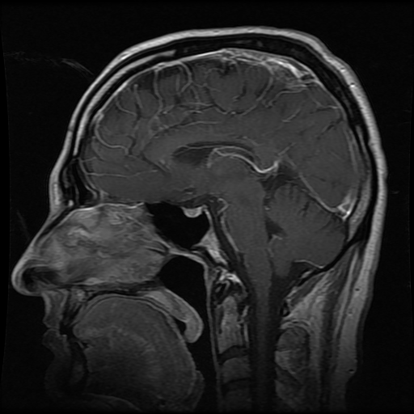
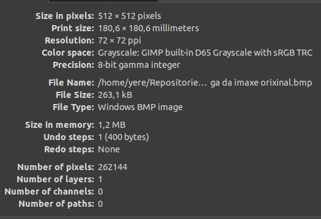
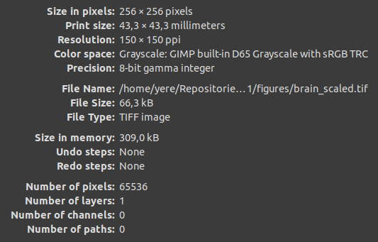

# Práctica 1

## Ejercicio 1

## Ejercicio 2

Según GIMP:

| Formato de la imagen              | .bmp (Windows BMP image) |
|-----------------------------------|--------------------------|
| Ancho (píxeles)                   | 512                      |
| Alto (píxeles)                    | 512                      |
| Ancho (cm)                        | 18.06                    |
| Alto (cm)                         | 18.06                    |
| Resolución (ppi)                  | 72 x 72                  |
| Tamaño que ocupa grabada (Kbytes) | 263.1                    |

## Ejercicio 3

Formato JPG:

Formato TIFF (pulsar enlace para ir al archivo y descargar):

## Ejercicio 4

Imagen TIFF con tamaño 256 × 256 y resolucion 150 × 150 ppi (pulsar enlace para ir al archivo y descargar):

Propiedades según GIMP:

## Ejercicio 5

[Word document](Practica-01.docx)
