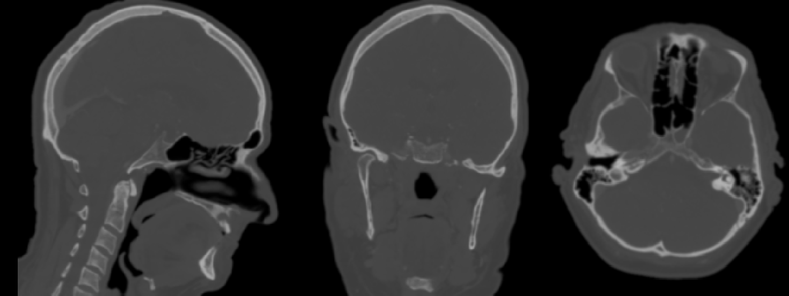
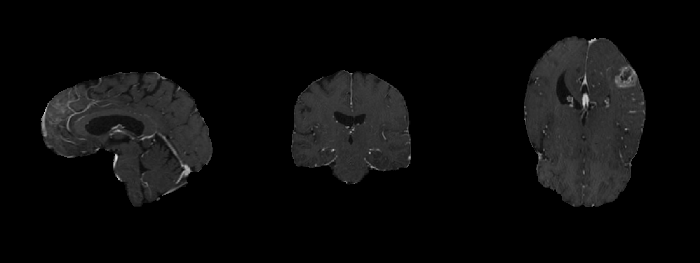

# Práctica 2: Modalidades e imaxes médicas.

## Ejercicio 1

Imagen 1:

Slice de Imagen 1:

Imagen 2:

Slice de Imagen 2:

## Ejercicio 2  

| Propiedad                       | Valor                                                                                                                                                                                                                                |
|---------------------------------|--------------------------------------------------------------------------------------------------------------------------------------------------------------------------------------------------------------------------------------|
| Nombre del archivo de la imagen | CT_Philips.nii.gz                                                                                                                                                                                                                    |
| Formato de la imagen            | NIfTI                                                                                                                                                                                                                                |
| Origen                          | [GitHub](https://github.com/neurolabusc/niivue-images/blob/main/CT_Philips.nii.gz), se puede descargar desde [Git LFS](https://github.com/YerePhy/neuroimagen-digital/blob/lab/practica-02/practica02/large-files/CT_Philips.nii.gz) |
| Modalidad                       | CT                                                                                                                                                                                                                                   |
| Resolución (tamaño de voxel)    | 0.9607 mm × 0.9639 mm × 0.9633 mm                                                                                                                                                                                                    |
| Tamaño (mm)                     | X=178 mm Y=224 mm Z=247 mm                                                                                                                                                                                                           |
| Dimensiones                     | 185 × 232 × 256                                                                                                                                                                                                                      |

| Propiedad                       | Valor                                                                                                                                                                                                                                            |
|---------------------------------|--------------------------------------------------------------------------------------------------------------------------------------------------------------------------------------------------------------------------------------------------|
| Nombre del archivo de la imagen | T1CE.nii.gz                                                                                                                                                                                                                                      |
| Formato de la imagen            | NIfTI                                                                                                                                                                                                                                            |
| Origen                          | [RSNA-ASNR-MICCAI BraTS Challenge 2021](http://braintumorsegmentation.org), puede descargarse en [Git LFS](https://github.com/YerePhy/neuroimagen-digital/blob/lab/practica-02/practica02/large-files/T1CE.nii.gz) |
| Modalidad                       | MRI                                                                                                                                                                                                                                              |
| Resolución (tamaño de voxel)    | 1 mm × 1mm × 1mm                                                                                                                                                                                                                                 |
| Tamaño (mm)                     | X=240 mm Y=240 mm Z=155 mm                                                                                                                                                                                                                       |
| Dimensiones                     | 240 × 240 × 155     
