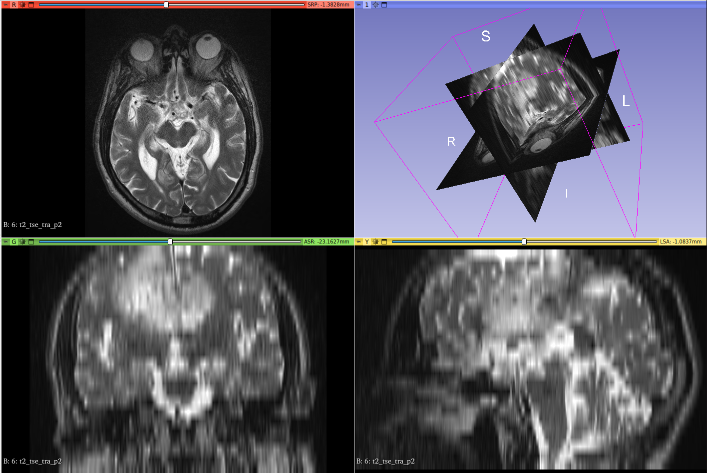

# Práctica 3: Manexo de aplicacións de exemplo para o tratamento de imaxes DICOM: Visores de estudos médicos

## Ejercicio 3

El archivo DICOM seleccionado ha sido `t2_tse_tra_p2-6.zip`, está disponible
para descargar en [Git LFS](https://github.com/YerePhy/neuroimagen-digital/tree/15334aa2535bd7da757ba301a474d7c9d0b2958e/practica03/large-files/t2_tse_tra_p2).
El visor escogido ha sido [3D Slicer](https://www.slicer.org/) para Linux.

Captura:

Datos de la imagen:

| Campo                                               | Valor                                     |
|-----------------------------------------------------|-------------------------------------------|
| Nombre del paciente que figura en el archivo        | CEREBRIX                                  |
| Modalidad                                           | MR                                        |
| Fabricante                                          | SIEMENS                                   |
| Número de imágenes del estudio                      | 1                                         |
| Número de imagen escogida por el alumno             | 1                                         |
| Tamaño de píxel                                     | 0.51339285714286 mm × 0.51339285714286 mm |
| Dimensiones                                         | 364 × 448                                 |
| Dimensiones físicas (Tamaño de píxel × Dimensiones) | 18.6875 cm × 28 cm                        |

El fichero Word se puede encontrar [aquí](Practica-03.docx).
